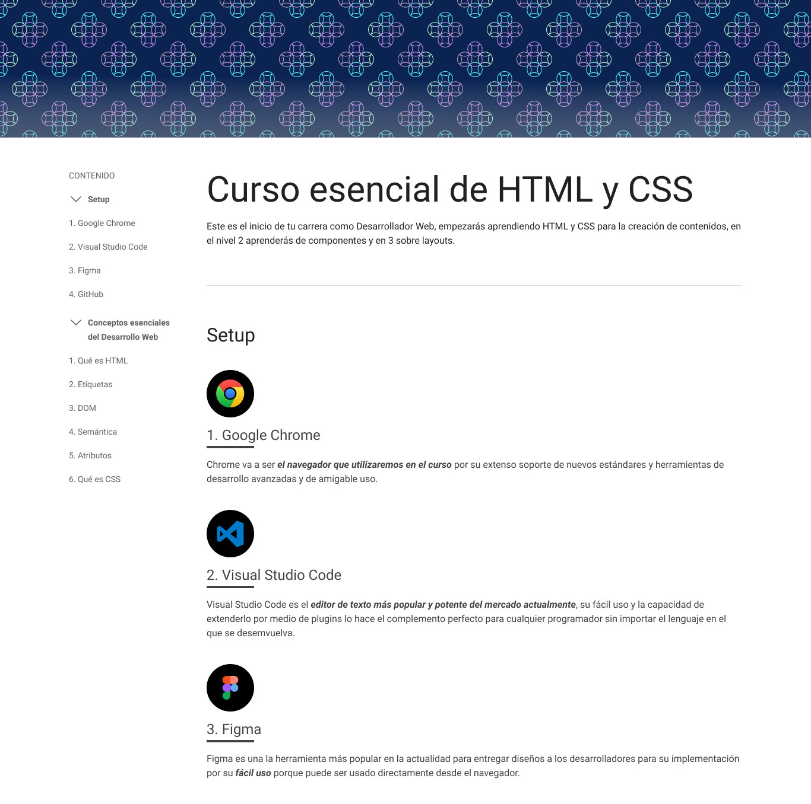
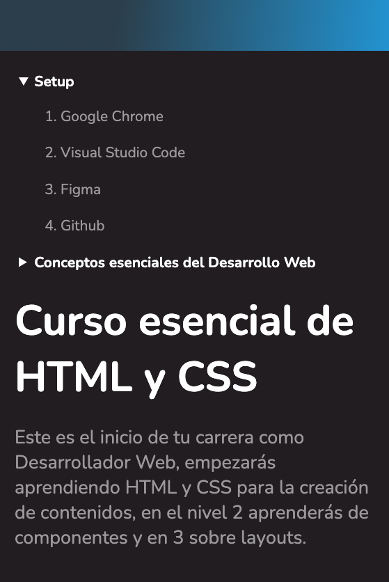

# Nemium

Crea la plantilla para tus blogpost con un diseño que ayuda con la estructura tu contenido. 

### Resultado 

## Desktop

Así lucirá la versión en modo Desktop de tu proyecto.

  

## Mobile
Así lucirá la versión en modo mobile de tu proyecto.

  

[Ver demo live](https://leonidasesteban.github.io/curso-esencial-html-css/)

## Disclaimer

Todas son propuestas al final /Proyectos es brindarte el diseño, el límite de la creación depende de tus ganas de hacerlo realidad y tu skills del momento a la hora de ejecutarlo.

## Nivel 1

Lleva la interfaz al código de la manera que mejor te parezca, es un proceso libre.
Puedes usar un framework o vanilla, **no hay limitaciones**.

Requerimientos

- Debe ser responsive
- Accesibilidad como prioridad
- OpenGraph custom
- Sube tu código a GitHub
- Publica tu resultado con github pages
- Mándalo a revisión

## Nivel 2

¿Puedes crear una interfaz sin flexbox y sin css grid? ¡Este será tu reto!

Crea el diseño con sólo HTML y CSS sin utilizar flexbox, sin utilzar CSS grid layout.

Requerimentos:

- Ni una línea de Flexbox ni CSS Layout
- Debe ser responsive
- Accesibilidad como prioridad
- OpenGraph custom
- Crea el carrusel sin JavaScript
- Sube tu código a GitHub
- Publica tu resultado con github pages
- Mándalo a revisión

Si se te complica crear esta interfaz probablemente te ayude el [Curso esencial de HTML y CSS](https://leonidasesteban.com/cursos/html-css-fundamentos)

## Nivel 3

¡Hazlo escalable! 
No sería una buena opción crear un documento html y añadirle estilos por cada blogpost que escribas, tu reto es hacer este diseño tu plantilla para cada blogpost que escribas.
Tendrás que consumir tus archivos Markdown y lograr que cada post respete estos estilos, ahora si tendrás un blog.

Puedes ayudarte de algunos servicios para consumir tus blogpost:
- Ghost
- Collected Notes
- Notion
- All notes

Requerimentos:

- Consume un API de tu contenido
- El form final debe funcionar, hacer un _post_ a algún servicio.
- Debe ser responsive
- OpenGraph custom
- Accesibilidad como prioridad

> El límite es tu creatividad, lleva el proyecto hasta donde desees.

### Bonus

Este proyecto cuenta con variantes en Figma, crealas y coloca un menú para navergar entre variantes.

Diseño creado por [leonidasesteban.com](https://leonidasesteban.com)

