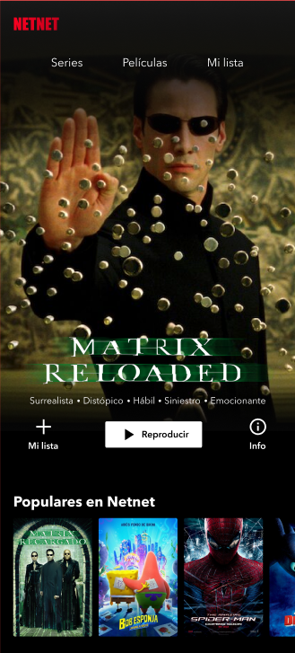

# NetNet

Construye la plataforma líder en streaming, permite a los usuarios acceder a sus series y peliculas favoritas desde la comodidad de sus teléfonos. 

## Mobile

## Disclaimer

Todas son propuestas, el proposito de **/Proyectos** es brindarte el diseño, el límite de la creación lo dictan tus ganas de hacerlo realidad y tu skills del momento a la hora de codear.

## Nivel 1

Estilo libre. Lleva el diseño al código utilizando tu framework favorito, o con HTML y CSS, no hay ninguna limitación. 

Requerimentos
- Accesibilidad como prioridad
- Sube tu código a GitHub
- Publica tu resultado con github pages
- Mándalo a revisión desde tu [perfil](https://leonidasesteban.com/estudiante)

## Nivel 2

¡Hazla funcionar! Consume una API de video y permite reproducirlos.

Requerimentos
- Accesibilidad como prioridad
- Sube tu código a GitHub
- Consume una API
- Dale vida al reproductor
- Publica tu resultado con github pages
- Mándalo a revisión desde tu [perfil](https://leonidasesteban.com/estudiante)

APIS que podrías usar:
[API de YouTube](https://developers.google.com/youtube/v3)
[API de Twitch](https://dev.twitch.tv/docs/api/)
[APi de Vimeo](https://developer.vimeo.com/api/reference)

## Nivel 3

Configura tu sitio para que pueda ser utilizado como una PWA. 

Requerimentos
- Accesibilidad como prioridad
- Sube tu código a GitHub
- Hazla PWA 
- Publica tu resultado con github pages
- Mándalo a revisión desde tu [perfil](https://leonidasesteban.com/estudiante)

## Créditos

Encuentra más proyectos asombrosos en [/Proyectos](https://leonidasesteban.com/proyectos)

Diseñado con ♥️ en leonidasesteban.com

